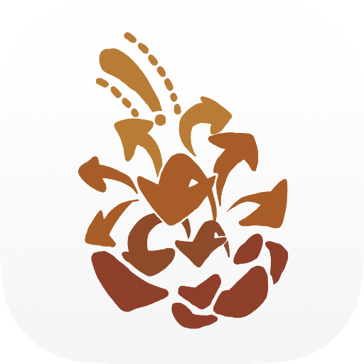

# 神奇松果（Magic Pinecone）

<p align="center">
  <a href="README.md">English</a> | 正體中文
</p>

<p align="center">
  
</p>

神奇松果（Magic Pinecone）是為國立中央大學學生打造的一站式校園應用程式。

本 repository 是原 Flutter App 的 Kotlin Multiplatform 重寫版本，目前仍在積極開發中。

> 想在瀏覽器中試用神奇松果？歡迎使用 [Lite 版本](https://magic-pinecone.github.io/magic-pinecone-lite/)。

## 功能

- **課程搜尋**：瀏覽及搜尋中大課程資料。
- **課表規劃**：選取課程、在課表中預覽，並明確儲存選課計畫。
- **離線儲存**：使用 Room 將課程資料及已儲存的課表保存在本機的 SQLite 資料庫。
- **原生平台外殼**：Android 使用 Jetpack Compose，iOS 使用 SwiftUI，並透過 KMP 重複使用核心邏輯、資料以及 Compose UI。

Flutter App 原有的 Portal 整合與 session 管理功能尚未遷移。

## 開始使用

### 前置需求

- JDK 17
- Android Studio，以及支援 API 37 的 Android SDK
- Xcode（用於執行 iOS App）

### 複製 repository

```bash
git clone https://github.com/magic-pinecone/mpc-compose.git
cd mpc-compose
```

### 執行 Android App

使用 Android Studio 開啟專案並執行 `androidApp` configuration，或透過下列指令建置 debug APK：

```bash
./gradlew :androidApp:assembleDebug
```

### 執行 iOS App

1. 在 [`iosApp/Configuration/Config.xcconfig`](iosApp/Configuration/Config.xcconfig) 中設定 Apple development team。
2. 使用 Xcode 開啟 [`iosApp/iosApp.xcodeproj`](iosApp/iosApp.xcodeproj)。
3. 選擇目標裝置後執行 App。

## 測試與檢查

執行 Android host 與 iOS simulator 上的 shared tests：

```bash
./gradlew :shared:testAndroidHostTest
./gradlew :shared:iosSimulatorArm64Test
```

執行專案設定的所有檢查：

```bash
./gradlew check
```

完整檢查也需要先安裝 [SwiftLint](https://github.com/realm/SwiftLint)。

## 致謝

- **應用程式圖示**：由**吳芮葶**設計。
- **課程資料**：[NCU-Course-Finder-DataFetcher-v2](https://github.com/zetaraku/NCU-Course-Finder-DataFetcher-v2)。
